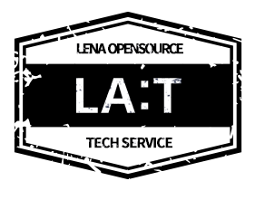

#   

This is the home of the LA:T Web Server.
A portable installation file including centos7,8 and amazon linux is provied based on Apache httpd.
LA:T Web server also provides everything required for creating and configuring Web Server so easily.

All feature following will be working with CLI.

The feature of LA:T Web server Open Edition : 

+ Installation : Create, Delete and Clone server. Don't need to type in much things when create server, just required server name and service port.
  Clone server is so useful when you wanna save the status of the server right away.
 
+ Execution : Start, Stop server. You can check the server status just with a command "ps". Just in case, service request is under abnomal status and you need to
              restart the server forcely. Use the command "force restart server_id". 

+ Package : Portable installation files are provided for each OS (Centos7, Centos8 ...). Installation is complete simply by extracting the installation file. We are in charge of difficult tasks such as Compile performed in the OS.

## Installation and Getting Started
You can get [installation guide](https://github.com/OpenLENA/lena-web/wiki/Installation-Guide) and getting started.

## Getting Help
If you are having some trouble with LA:T? Contact us the way you want.
+ Check the reference documentation.
+ Notify the problem with creating issue.
+ Feel free to join our community and ask that to us.

## Reporting Issues
We use GitHub's integrated issue tracking system to record bugs and other issues. Following are recommendations to keep the rule for reporing issues.
+ Check what the issue you found out is already recorded or not.
+ If there is nothing, [Create issues](https://github.com/OpenLENA/lena-web/issues/new).
+ Keep the rule for commit message.
+ If possible, try to create a test-acse.

## Modules
#### web-oss
Manage open sources required for httpd compile such as httpd, apr, pcre, and tomcat-connectors.
#### web-core
Manage modules added/modified in LA:T.
#### web-template
Manages the configuration file included by default when creating a portable installation file.
#### web-compile 
It creates a portable installation file based on web-oss, web-core, and web-template.

## Release
LENA will be released every each quarter. You can get [released files](https://github.com/OpenLENA/lena-web/releases) and check what is changed in release note.

## Roadmap
You can find a roadmap of LENA [here](https://github.com/OpenLENA/lena-web/wiki/2021-Roadmap).

## Community
[Google Groups](https://groups.google.com/g/openlena)

## License
LENA Web Server Open Edition is Open Source software released under the Apache 2.0 license.
